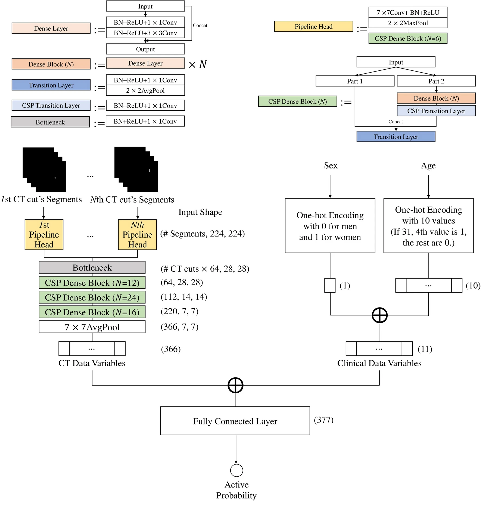

 
# Implementation of MTANet using PyTorch Deep Learning Framework
 
The architecture was inspired by Neural network application for assessing thyroid-associated orbitopathy activity using orbital computed tomography. 

## Overview
This repository contains an official implementation of MTANet using PyTorch.<br/>
Please refer to the paper at the following page: 
[Neural network application for assessing thyroid-associated orbitopathy activity using orbital computed tomography](https://www.nature.com/articles/s41598-023-40331-1 "Visit")

## Model

## Paper
If you use this software for your research, please cite:

```bibtex
@article{lee2023neural,
  title={Neural network application for assessing thyroid-associated orbitopathy activity using orbital computed tomography},
  author={Lee, Jaesung and Lee, Sanghyuck and Lee, Won Jun and Moon, Nam Ju and Lee, Jeong Kyu},
  journal={Scientific Reports},
  volume={13},
  number={1},
  pages={13018},
  year={2023},
  publisher={Nature Publishing Group UK London}
}
```

## License
This program is available for download for non-commercial use, licensed under the GNU General Public License. This allows its use for research purposes or other free software projects but does not allow its incorporation into any type of commercial software.

## Files
The repository contains the following files:

- `MTANet.py`: Python script file, containing the PyTorch implementation of the MTANet.
- `README.md`: Markdown file explaining the model source code.
